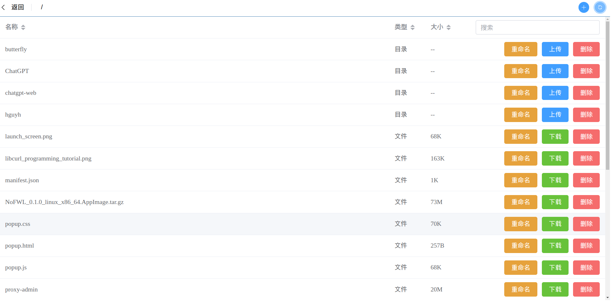

#### webbox
一个基于`Go gin`的http文件服务器。通过http请求下载，上传和删除文件。具体使用方法参考下面说明。

### 运行
- frontend:
    - `make download-dependence`
    - `make run`

- backend:
    - `make gen_denpendence`
    - `make download-dependence`
    - `make run`

### 使用
- webbox命令行
    - `webbox -query=true` 查询用户
    - `webbox -add=<username,password>` 添加用户
    - `webbox -del=<username>` 删除用户

- 启用https
    - 修改配置文件`EnableTLS: true`
    - 程序启动会生成默认的证书和私钥文件，放置在`~/.config/webbox/cert.pem` 和 `~/.config/webbox/key.pem`。 默认证书仅支持本地回环地址访问。需要支持外部网络访问需要替换为自己的证书和私钥。

- frontend使用nginx进行反向代理：
    - nginx 反向代理配置
    ```
    location /webbox/ {
        proxy_pass http://127.0.0.1:8003/;
        }

    ```

    - nginx提供web服务
    ```
    server {
        listen 8003;
        server_name heng30.xyz;

        root /home/blue/mountpoint/html/webbox;
        index index.html;

        location / {
        try_files $uri $uri/ =404;

        # 将index.html中的绝对路径更改为相对路径
        sub_filter 'src="/' 'src="';
        sub_filter 'href="/' 'href="';
        sub_filter_types html;
        sub_filter_once off;
        }
    }

    ```

- backend使用nginx进行方向代理
    - 修改`frontend/src/ts/config.ts`后，重新带包：`npm run build`
    ```
    const prefixpath = '/webbox/api'; // if use proxy_pass for apiserver in nginx, set this variable.
    ```

    - nginx 配置
    ```
    location /webbox/api/ {
        proxy_pass http://127.0.0.1:8002/;
    }

    ```

### 参考
- [go安装依赖包（go get, go module）](https://blog.csdn.net/weixin_41519463/article/details/103501485)
- [Golang设置代理](https://developer.aliyun.com/article/879662)
- [Gin 解决跨域问题跨域配置](https://juejin.cn/post/6871583587062415367)
- [Go 入门指南](https://learnku.com/docs/the-way-to-go)
- [vuejs](https://cn.vuejs.org/guide/introduction.htmlhttps://cn.vuejs.org/guide/introduction.html)
- [element-plus](https://element-plus.gitee.io/zh-CN/)
